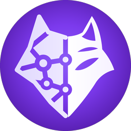
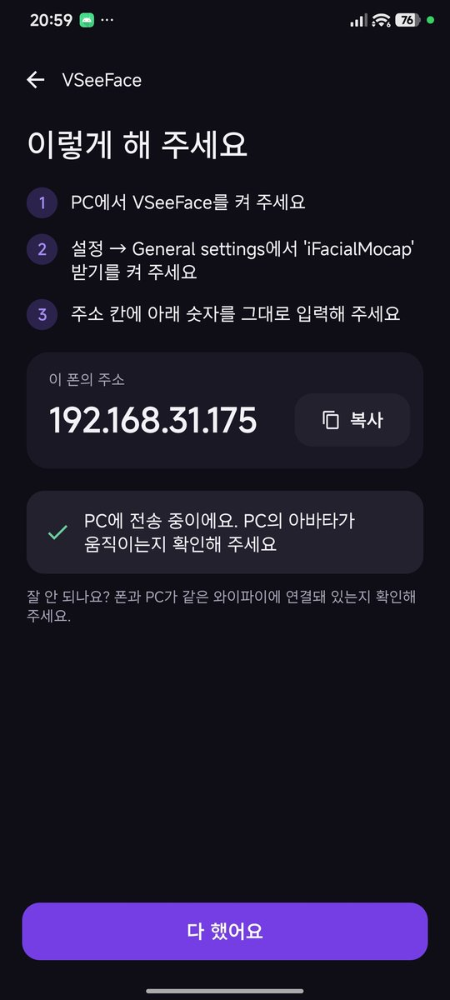
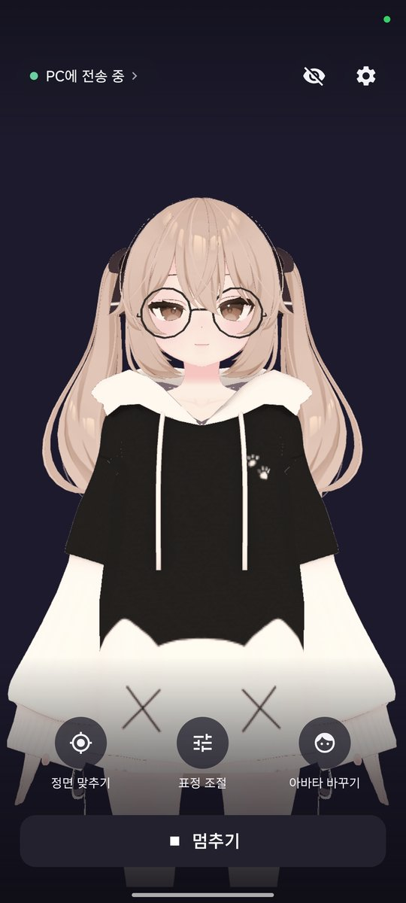
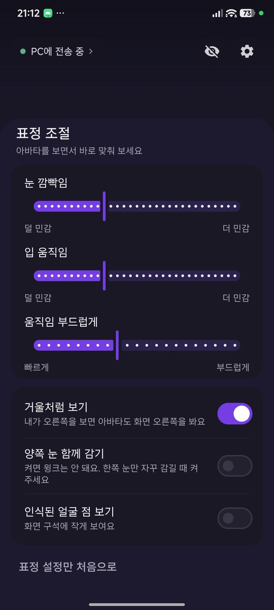

# VRMdroid

[한국어](../README.md) · [English](README.en.md) · **日本語** · [中文](README.zh.md)

**iPhone がなくても、Android スマホでできる VTuber フェイストラッキング**

<!-- 成果物 GIF：スマホの前で表情を作ると PC のアバターが同じ表情をするシーン -->

### [最新リリース（APK）](https://github.com/ouor/VRMdroid/releases/latest)

> [!NOTE]
> **カメラの映像がスマホの外に出ることはありません。**  
> 顔の認識はすべてスマホの中で行い、PC には表情の数値だけを送ります。
> インターネット上のサーバーには一切接続しません。

> [!IMPORTANT]
> アプリの画面は現在、韓国語のみの対応です。このページでは、ボタンや項目の名前を日本語の意味のあとに（ ）で韓国語の表示名を添えて書いているので、画面で探すときの目印にしてください。

## 📸 使い方

1. **アバターを選ぶ（아바타 고르기）**：スマホに入っている VRM ファイルを選びます。まだ持っていなくても、サンプルアバターでまず試せます。
2. **PC のソフトを選ぶ**：VSeeFace、VNyan、Warudo の中から使っているソフトを選ぶと、PC で押すメニューと入力するアドレスを案内してくれます。
3. **スタート（시작하기）**：スマホを顔の前に置いて **スタート（시작하기）** をタップすると、PC のアバターがあなたの表情に合わせて動きます。

PC と接続（PC와 연결하기） · メイン画面 · 表情の調整（표정 조절）

## ✨ できること

- **iPhone と同じ表情**：iPhone のトラッキングと同じ 52 種類の表情を送ります。iPhone 向けに調整したアバター（パーフェクトシンク対応モデルなど）をそのまま使えます。
- **スマホでプレビュー**：スマホの画面の中でも、アバターがあなたの表情に合わせて動きます。PC につなぐ前に、トラッキングがうまく動いているか確認できます。
- **接続ガイド**：PC のソフトを選ぶと手順をひとつずつ案内し、つながったらすぐにお知らせします。
- **表情の調整（표정 조절）**：まばたきや口の開き具合の感度、動きのなめらかさを、アバターを見ながら調整できます。
- **正面合わせ（정면 맞추기）**：3 秒間画面を見つめると、今の姿勢を正面として設定します。
- **リアルタイムデバッグコンソール（실시간 디버깅 콘솔）**：PC に送っている表情の数値と送信速度を、メイン画面でそのまま確認できます。設定（설정）からオンにします。
- **画面をすっきり（화면 깨끗하게）**：ボタンをすべて隠して、スマホの画面をそのまま録画したり見せたりできます。
- **長時間つけっぱなしでも安心**：席を外すと画面の明るさを落として暗くし、バッテリーを節約します。その間もトラッキングと PC への送信は続きます。

### こんなときにおすすめ

- iPhone は持っていないけれど、VSeeFace や Warudo で iPhone 並みの表情トラッキングを使いたいとき
- Web カメラがない、または Web カメラのトラッキングではまばたきや口の形がうまく追従しないとき
- 配信だけで PC が手いっぱいなとき。顔の認識はスマホが担当し、PC は受け取った数値でアバターを動かすだけです。
- PC なしで、スマホだけで自分の VRM アバターを動かしてみたいとき

## 🖥️ 一緒に使える PC ソフト

| ソフト | アプリで選ぶもの | PC ソフトでやること |
|---|---|---|
| VSeeFace | VSeeFace | 設定 → General settings で iFacialMocap の受信をオンにして、スマホのアドレスを入力 |
| VNyan、Warudo など | VNyan、Warudo など（VNyan · Warudo 등） | トラッキング方式で iPhone / iFacialMocap を選んで、スマホのアドレスを入力 |
| VMagicMirror など VMC を受信できるソフト | VMC で受信するソフト（VMC로 받는 프로그램） | VMC の受信をオンにしてポートを 39539 に合わせたあと、アプリに PC のアドレスを入力 |

スマホと PC は **同じ Wi-Fi** に接続しておく必要があります。メニューの名前はソフトのバージョンによって少し違うことがあります。

## ⬇️ インストール

1. [最新リリース](https://github.com/ouor/VRMdroid/releases/latest)から `.apk` ファイルをダウンロードします。
2. ダウンロードしたファイルを開きます。「不明なアプリのインストール」の案内が出たら **設定** をタップして、この提供元（ブラウザやファイルアプリ）からのインストールを許可します。
3. Play プロテクトの警告が出たら **詳細 → インストールする** をタップします。Play ストアを経由していないアプリなので表示される案内です。

**アップデート** は、新しいバージョンの APK をそのままインストールするだけで OK です。設定やアバターはそのまま残ります。

### 必要なもの

- Android 12 以上、64 ビット（arm64）のスマホ
- PC と同じ Wi-Fi
- Dimensity 8300 搭載のスマホで、1 秒あたり 25〜30 回表情を送信します。スマホの性能や温度によって変わります。

## 🔒 プライバシー

- カメラの映像は **保存もしないし、外にも送りません。** 顔がどう動いたかだけを使います。
- PC に送るのは **表情の数値と頭の角度だけ** で、送り先は自分で指定した PC だけです。
- 使う権限は 2 つです。
  - **カメラ**：表情を読み取るため
  - **インターネット**：同じ Wi-Fi 上の PC に表情の数値を送るため
- 広告、分析ツール、アカウントへのログインはありません。

## 🙋 よくある質問

| こんなとき | 試してみてください |
|---|---|
| インストールできない | 「不明なアプリのインストール」が許可されているか確認してください。Android 11 以下や 32 ビットのスマホにはインストールできません。 |
| PC のアバターが動かない | スマホと PC が同じ Wi-Fi につながっているか確認してください。ゲスト用 Wi-Fi や公衆 Wi-Fi は、機器同士の通信をブロックしていることがよくあります。 |
| PC のソフトがスマホを見つけられない | PC のソフトを初めて起動したときに出た Windows ファイアウォールの画面で「プライベート ネットワーク」を許可したか確認してください。すでに拒否してしまった場合は、Windows セキュリティ → ファイアウォールとネットワーク保護 から許可できます。 |
| 接続状態を確認したい | アプリ上部のステータス表示をタップすると、今なにを待っているかとスマホのアドレスが表示されます。 |
| アバターが正面を向かない | スマホを顔の前に置いて **正面合わせ（정면 맞추기）** をタップしてください。 |
| スマホが熱くなる | 長時間配信するなら、充電器をつないで、スマホをケースから出しておくのがおすすめです。 |

問題が解決しないときは、[Issues](https://github.com/ouor/VRMdroid/issues) にスマホの機種名と PC のソフト名を添えて書き込んでください。

---

## 🛠️ 開発者向けメモ

ここから先は、アプリを自分でビルドしたり改造したりしたい方向けの内容です。

- ビルド方法と構成：[BUILDING.md](BUILDING.md)（韓国語）
- 使用している技術
  - アプリ：Kotlin、CameraX
  - 顔認識：MediaPipe Face Landmarker
  - アバターのプレビュー：Unity 6（UniVRM）
  - 送信方式：iFacialMocap、VMC プロトコル
- ライセンス：[MIT](../LICENSE)。サンプルアバター *Sendagaya Shibu* は VRoid Studio のサンプルモデル（CC0）です。
